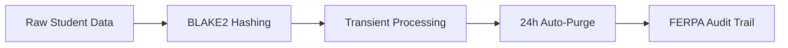

# 🚀 SaarAI – Automated Student Insight & Report Generator

[](https://www.python.org/)
[](https://www2.ed.gov/policy/gen/guid/fpco/ferpa/index.html)
[](https://www.reportlab.com/)

**End-to-end pipeline for generating personalized student reports with AI analysis, PDF generation, and privacy-first data handling.**

---

## ✨ Core Capabilities
| Feature | Implementation | Key Benefit |
|---------|----------------|-------------|
| **Smart Data Ingestion** | Google Sheets API + CSV fallback | Live data sync or offline testing |
| **AI-Powered Analysis** | Gemini 1.5 Flash with custom prompts | Identifies strengths/weaknesses in 8+ languages |
| **Accessible PDF Engine** | ReportLab + dyslexia-friendly styling | WCAG 2.1 compliant outputs |
| **Secure Delivery** | Encrypted SMTP with SSL/TLS | Multi-language email delivery |
| **Auto-Cleanup** | BackgroundScheduler + BLAKE2 hashing | FERPA-compliant data lifecycle |

---

## 🏗️ Project Architecture
```
SaarAI/
├── main.py                 # Pipeline orchestrator
├── data_processor.py       # Data validation & Google Sheets connector
├── report_generator.py     # Gemini interaction & VARK analysis
├── pdf_engine.py           # PDF builder + email delivery
├── privacy_manager.py      # Data purging service
├── prompts/                # AI prompt templates
│   ├── analysis.jinja
│   ├── narrative.jinja
│   └── whisper.jinja
├── templates/              # HTML/CSS assets
├── reports/                # Generated PDFs (auto-created)
└── temp/                   # Transient files (auto-purged)
```

---

## 🚀 Getting Started

### Prerequisites
- Python 3.10+
- Google Cloud service account
- Gemini API key
- SMTP credentials

### Installation
```bash
# Create virtual environment (Windows)
python -m venv .venv
.venv\Scripts\activate

# Install dependencies
pip install -r requirements.txt
```

### Configuration
Create `.env` file in project root:
```ini
# REQUIRED SETTINGS
GEMINI_API_KEY=your_google_ai_key_here
GOOGLE_SHEETS_ID=your_spreadsheet_id_here

# OPTIONAL OVERRIDES
FERPA_SALT=random_salt_here          # Default: auto-generated
SMTP_PORT=587                        # Default: 465
SMTP_USE_SSL=false                   # Default: true
```

### Execution
```bash
python main.py
```

**Pipeline Workflow:**
1. 📥 Fetch student data from Google Sheets
2. 🤖 Generate personalized PDF reports
3. ✉️ Email reports to guardians
4. 🗑️ Schedule 24-hour data purge

---

## 🔧 Advanced Usage

### Customizing AI Analysis
Modify prompt templates in `/prompts`:
```jinja
{# narrative.jinja #}
Identify THREE key strengths in {{student_name}}'s performance in 
{{target_subject}} based on these scores: {{subject_grades}}...
```

### PDF Accessibility Features
Enable in `pdf_engine.py`:
```python
# Apply dyslexia-friendly settings
styles = get_style_profile(
    profile='dyslexia',   # Options: adhd, low_vision, standard
    font_size=14
)
```

### Deployment Options
| Method | Command | Use Case |
|--------|---------|----------|
| **Windows Task Scheduler** | `python main.py` | School district servers |
| **Docker** | `docker run -v ./reports:/app/reports saarai` | Cloud deployments |
| **FastAPI** | Mount `generate_reports()` as endpoint | On-demand generation |

---

## 🔐 Privacy & Compliance


**Security Implementation:**
```python
# privacy_manager.py
def mask_student_id(student_id: str) -> str:
    return blake2b(
        (FERPA_SALT + student_id).encode(),
        digest_size=16
    ).hexdigest()
```

**Data Lifecycle:**
- Student ID masking with salt-based BLAKE2 hashing
- All files in `/reports` and `/temp` auto-deleted after 24h
- No long-term PII storage on disk
- SSL/TLS encryption for all external communications

---

## 🛠️ Troubleshooting Guide

| Symptom | Diagnosis | Solution |
|---------|-----------|----------|
| `InvalidValueError` for API key | Missing Gemini credentials | Verify `.env` file exists |
| Sheets connection timeout | Incorrect sheet ID/service account | Enable Sheets API in Google Cloud |
| PDF generation failure | Missing system fonts | Install `liberation-fonts` package |
| Email delivery failure | SMTP authentication error | Test credentials with manual telnet |
| Cleanup not triggering | BackgroundScheduler issue | Check APScheduler logs |

---
